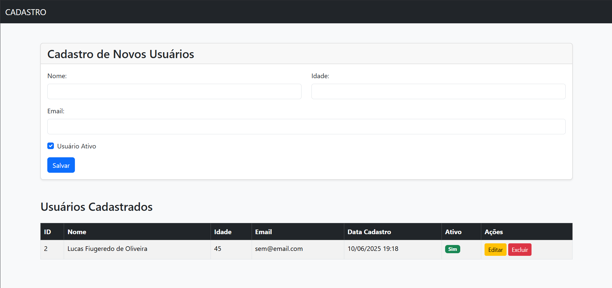

# Sistema de Cadastro de Usuários (CRUD com Django)



## 📝 Descrição do Projeto

Este é um projeto Full Stack desenvolvido em Python com o framework Django. A aplicação implementa um sistema completo de CRUD (Create, Read, Update, Delete) para gerenciar um cadastro de usuários. A interface foi estilizada com Bootstrap 5 para uma aparência limpa e profissional.

---

## ✨ Funcionalidades

-   **Create**: Adicionar novos usuários através de um formulário.
-   **Read**: Listar todos os usuários cadastrados em uma tabela.
-   **Update**: Editar as informações de um usuário existente.
-   **Delete**: Excluir um usuário do sistema com uma confirmação.
-   Interface responsiva e amigável graças ao Bootstrap.

---

## 🛠️ Tecnologias Utilizadas

-   **Backend**: Python, Django
-   **Frontend**: HTML, CSS, Bootstrap 5
-   **Banco de Dados**: SQLite3 (padrão do Django para desenvolvimento)
-   **Gerenciamento de Pacotes**: PIP

---

## 🚀 Como Rodar o Projeto Localmente

Siga os passos abaixo para executar a aplicação na sua máquina.

**1. Clone o Repositório:**
```bash
git clone [https://github.com/SEU-NOME-DE-USUARIO/django-crud-cadastro.git](https://github.com/SEU-NOME-DE-USUARIO/django-crud-cadastro.git)
cd django-crud-cadastro
```

**2. Crie e Ative um Ambiente Virtual:**
```bash
# Criar o ambiente
python -m venv venv

# Ativar no Windows
.\venv\Scripts\Activate

# Ativar no Linux/Mac
source venv/bin/activate
```

**3. Instale as Dependências:**
```bash
pip install -r requirements.txt
```

**4. Aplique as Migrações do Banco de Dados:**
```bash
python manage.py migrate
```

**5. Inicie o Servidor de Desenvolvimento:**
```bash
python manage.py runserver
```

**6. Acesse a Aplicação:**
Abra seu navegador e acesse `http://127.0.0.1:8000/`

---

Desenvolvido por **[Seu Nome]**.